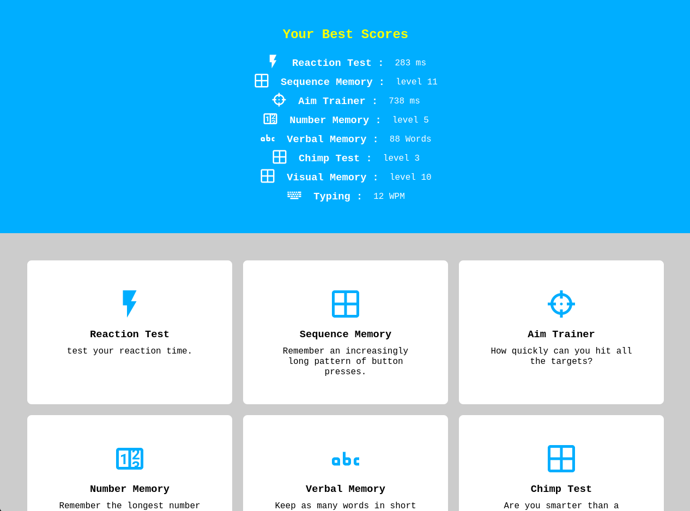

this is a clone of [human benchmark](https://humanbenchmark.com/) website, built using reactJS.
check the live link below if you wanna try it out.

## Built With

- ReactJs

## Getting Started

- clone the repository by running
  `git clone https://github.com/rachidelaid/human-benchmark.git`
- navigate to the folder
  `human-benchmark`
- install all the dependencies
  `npm i`
- run the app locally
  `npm run start`

## Live Link

[Live Link](https://human-banchmark.herokuapp.com)

## Authors

👤 **Rachid El aid**

- GitHub: [@rachidelaid](https://github.com/rachidelaid)
- Twitter: [@rachidelaid1](https://twitter.com/rachidelaid1)
- LinkedIn: [rachid elaid](https://www.linkedin.com/in/rachid-elaid-106336203/)

## Show your support

Give a ⭐️ if you like this project!
